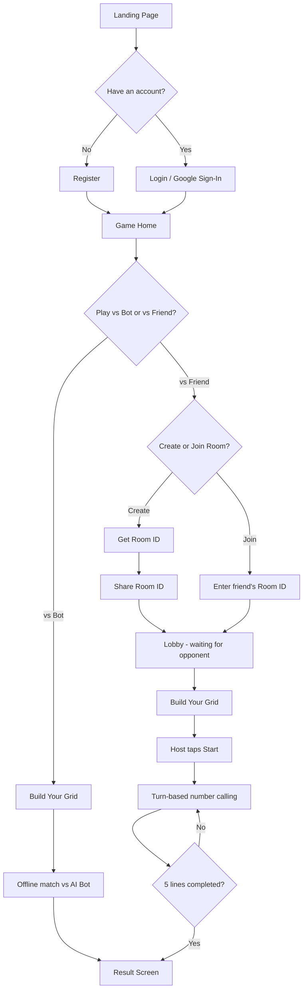
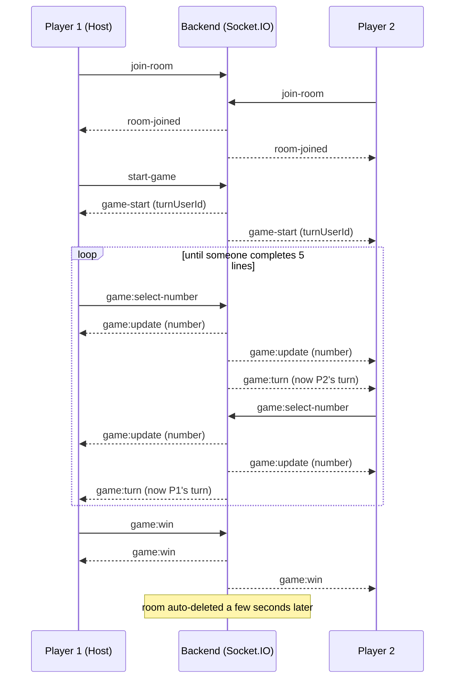

<div align="center">


# BingoGame

**A real-time, head-to-head Bingo game — build your own card, call your own numbers, and race a friend (or a smart bot) to complete 5 lines first.**

[](https://react.dev/)
[](https://nodejs.org/)
[](https://socket.io/)
[](https://flutter.dev/)
[](https://www.mongodb.com/)
[](https://firebase.google.com/)

[**🔴 Live Demo**](https://bingogame-web-t73z.vercel.app/) · [Report a Bug](../../issues) · [Request a Feature](../../issues)

</div>

---

## Overview

BingoGame is a full-stack, real-time multiplayer take on classic Bingo (Tambola/Housie style). Instead of a caller reading out random numbers, **each player builds their own 5×5 card** (numbers 1–25, no duplicates) and the two players take turns picking a number from their own card. Whatever number you "call" gets marked on **both** players' grids at once — so every turn is a small trade-off between advancing your own lines and accidentally helping your opponent complete theirs.

First player to complete **5 lines** (rows, columns, or diagonals) wins. Play a friend over the internet with a shareable room code, or play instantly offline against a bot that actually thinks a couple of moves ahead.

The project ships as three coordinated apps sharing one backend:

| App        | Stack                                   | Platforms                                |
| ---------- | --------------------------------------- | ---------------------------------------- |
| `web/`     | React 19 + Vite                         | Browser                                  |
| `app/`     | Flutter                                 | Android, iOS, Web, Windows, macOS, Linux |
| `backend/` | Node.js + Express + Socket.IO + MongoDB | —                                        |

---

## Features

- **Auth** — email/password signup or Google Sign-In (Firebase), JWT for mobile clients, sessions for web
- **Custom or random Bingo card** — manually type your own 1–25 grid, or generate a random one with duplicate-checking
- **Real-time 1v1 multiplayer** over WebSockets (Socket.IO) with a shareable Room ID
- **Play vs. Bot offline** — no backend/opponent needed, powered by a lookahead heuristic AI
- **In-game live chat** with your opponent
- **Reconnect grace period** — a dropped connection doesn't instantly cost you the match (5s grace before you're removed, opponent auto-wins only if you don't come back)
- **Player stats** — wins / losses / games played tracked per account
- **Light & dark theme**
- **Cross-platform client** via Flutter, in addition to the web app

---

## How It Works — The Full Flow

### 1. Player journey



### 2. What actually happens on a "turn" (the core mechanic)

This is the part that makes the game interesting — it isn't a caller reading numbers, it's a shared number pool:

1. Each player fills their own 5×5 grid with the numbers **1–25** (no repeats).
2. On your turn, you tap **one of your own still-unmarked numbers**.
3. That number is broadcast to the room — it gets marked as "chosen" on **both** grids, wherever it appears.
4. The grid is re-evaluated: 12 possible lines exist (5 rows + 5 columns + 2 diagonals). Any line where all 5 cells are marked counts as **completed**.
5. Turn passes to the other player, and repeats.
6. The moment **either player's own grid** reaches **5 completed lines**, that player wins immediately and the match ends.

Because the same number marks both cards, every pick is a small dilemma: is this number more useful to me right now, or am I about to hand my opponent a line?

### 3. Real-time architecture (multiplayer mode)



If a player disconnects mid-match, the server waits **5 seconds** for them to reconnect before removing them; if the match had already started and only one player remains, that player is awarded the win automatically.

### 4. The bot (offline mode)

`pickBotMove()` isn't a random-number picker. For every candidate number it can call, it simulates the result on **both** grids and scores the move:

- An instant winning move for the bot is picked immediately.
- A move that would hand the opponent an instant win is avoided if any alternative exists.
- Otherwise it scores each candidate by how close it gets _its own_ lines to completion, minus how close it gets the _opponent's_ lines to completion, then looks one reply ahead to avoid moves that set the human up for a strong counter.

---

## Tech Stack

**Frontend (web)** — React 19, Vite, React Router 7, Axios, Firebase JS SDK, Socket.IO client

**Backend** — Node.js, Express 5, Socket.IO, MongoDB + Mongoose, express-session + connect-mongo, JWT, Firebase Admin SDK (Google Sign-In verification), Docker

**Mobile / Desktop** — Flutter (Android, iOS, Windows, macOS, Linux, Web), `socket_io_client`, `http`, `shared_preferences`

---

## Project Structure

```
BingoGame/
├── web/                      # React + Vite browser client
│   └── src/
│       ├── pages/            # Landing, Login, Register, GameHome,
│       │                     # CreateRoom, JoinRoom, Show-RoomId, Lobby,
│       │                     # Grid (card builder), CreateBot, Game, Result, ChatBox
│       ├── services/         # api.js, socket.js, firebase.js
│       └── utils/bingoGame.js  # grid marking, win evaluation, bot AI
│
├── backend/                  # Express API + Socket.IO server
│   └── src/
│       ├── config/           # db.js, firebase.js, socket.js (all realtime logic)
│       ├── routes/           # auth.route.js, game.route.js (room create/join)
│       ├── database/User.js  # user schema (stats, auth)
│       └── server.js         # app bootstrap, CORS, sessions, health check
│
├── app/                      # Flutter client (mobile + desktop + web build)
│
├── quick-start.sh / .bat     # convenience scripts to run each part
└── FLUTTER_SETUP.md          # detailed API + socket-event reference
```

---

## Getting Started

### Prerequisites

- Node.js 18+
- A MongoDB connection string (local or [MongoDB Atlas](https://www.mongodb.com/atlas))
- Flutter SDK (only if you want to run the mobile/desktop app)
- A Firebase project (only needed for Google Sign-In)

### 1. Backend

```bash
cd backend
npm install
```

Create `backend/.env`:

```env
MONGODB_URI=mongodb+srv://<user>:<password>@cluster.mongodb.net/bingo
PORT=5000
NODE_ENV=development
SESSION_SECRET=some_strong_random_secret
JWT_SECRET=some_other_strong_secret

# Only needed for Google Sign-In:
FIREBASE_PRIVATE_KEY=your_firebase_private_key
FIREBASE_CLIENT_EMAIL=your_firebase_client_email
FIREBASE_PROJECT_ID=your_firebase_project_id
```

```bash
npm run dev        # http://localhost:5000, health check at /health
```

### 2. Web app

```bash
cd web
npm install
npm run dev         # http://localhost:5173
```

### 3. Flutter app

```bash
cd app
flutter pub get
flutter run --dart-define=API_BASE_URL=http://localhost:5000/api
```

> Start the backend before testing multiplayer — both the web and Flutter clients talk to it for auth, room creation, and the Socket.IO connection.

### Try it instantly (hosted demo)

Live app: **https://bingogame-web-t73z.vercel.app/**

| Email                  | Password |
| ---------------------- | -------- |
| ajaditya1908@gmail.com | 1907     |
| tushar@gmail.com       | 2611     |

_(Demo accounts only — please don't rely on them for anything real.)_

---

## 🔌 API & Socket Reference

**REST**

| Method | Route                   | Purpose                            |
| ------ | ----------------------- | ---------------------------------- |
| POST   | `/api/register`         | Create an account                  |
| POST   | `/api/login`            | Email/password login               |
| POST   | `/api/google`           | Google Sign-In (Firebase token)    |
| GET    | `/api/verify-token`     | Validate a JWT (mobile clients)    |
| POST   | `/api/game/room/create` | Create a room, returns `roomId`    |
| POST   | `/api/game/room/join`   | Check if a room exists / has space |
| GET    | `/health`               | Health check                       |

**Socket.IO events**

| Direction       | Event                | Payload                                     |
| --------------- | -------------------- | ------------------------------------------- |
| Client → Server | `join-room`          | `{ roomId, user }`                          |
| Client → Server | `start-game`         | `{ roomId }`                                |
| Client → Server | `game:select-number` | `{ roomId, number, userId }`                |
| Client → Server | `game:win`           | `{ roomId, userId }`                        |
| Client → Server | `chat:send`          | `{ roomId, message, senderId, senderName }` |
| Client → Server | `leave-room`         | `{ roomId }`                                |
| Server → Client | `room-joined`        | list of players in the room                 |
| Server → Client | `game-start`         | `{ turnUserId }`                            |
| Server → Client | `game:update`        | `{ number }` — mark it on your grid         |
| Server → Client | `game:turn`          | `{ userId }` — whose turn it is now         |
| Server → Client | `game:win`           | `{ userId }`                                |
| Server → Client | `chat:receive`       | `{ message, senderId, senderName, time }`   |

---

## Contributing 🤝

1. Fork the repo and clone your fork
2. Create a branch: `git checkout -b feature/your-idea`
3. Make your changes and test locally (backend + web, or app, depending on scope)
4. Commit with a clear message and push to your fork
5. Open a pull request describing what changed and why

Bug reports and small, focused PRs (a single fix or feature) are the easiest to review.

---

## Author

Built by [**aj-aditya19**](https://github.com/aj-aditya19).
