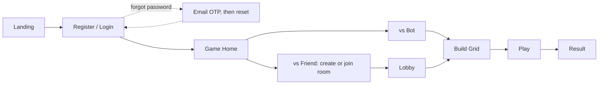
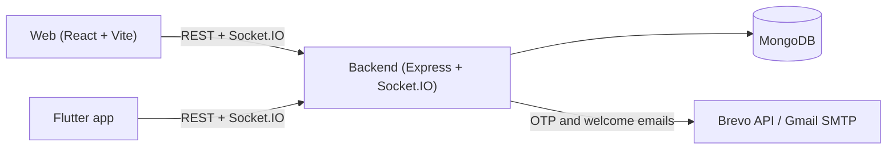
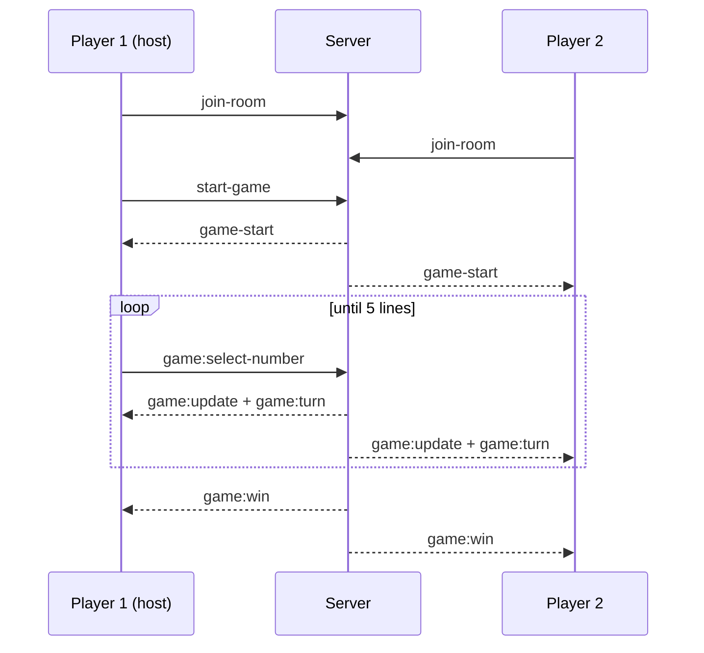
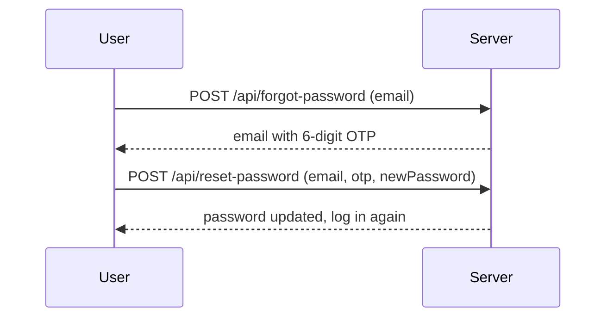

<div align="center">


# BingoGame

**A real-time, head-to-head Bingo game: build your own card, call your own numbers, and race a friend (or a smart bot) to complete 5 lines first.**

[](https://react.dev/)
[](https://nodejs.org/)
[](https://socket.io/)
[](https://flutter.dev/)
[](https://www.mongodb.com/)
[](https://www.docker.com/)
[](.github/workflows/ci.yml)

[**🔴 Live Demo**](https://bingogame-web-t73z.vercel.app/) · [Report a Bug](../../issues) · [Request a Feature](../../issues)

</div>

---

## 📑 Table of Contents

[Overview](#overview) · [Features](#features) · [How It Works](#how-it-works) · [Architecture](#architecture) · [Tech Stack](#tech-stack) · [Project Structure](#project-structure) · [Getting Started](#getting-started) · [Docker](#docker) · [CI](#cicd) · [API Reference](#api--socket-reference) · [Contributing](#contributing)

---

## Overview

BingoGame is a full-stack, real-time multiplayer take on classic Bingo (Tambola/Housie style). Instead of a caller reading random numbers, **each player builds their own 5×5 card** (numbers 1–25, no duplicates) and the two players take turns picking a number from their own card. A picked number is marked on **both** grids at once, so every turn is a trade-off between advancing your own lines and accidentally helping your opponent.

First to complete **5 lines** (rows, columns or diagonals) wins. Play a friend online with a room code, or play instantly against a bot that thinks a couple of moves ahead.

| App        | Stack                                   | Platforms                                |
| ---------- | --------------------------------------- | ---------------------------------------- |
| `web/`     | React 19 + Vite                         | Browser                                  |
| `app/`     | Flutter                                 | Android, iOS, Web, Windows, macOS, Linux |
| `backend/` | Node.js + Express + Socket.IO + MongoDB | Docker / any Node host                   |

---

## Features

| 🎮 Gameplay                                         | 🔐 Accounts                                    | 🛠️ Engineering                                         |
| --------------------------------------------------- | ---------------------------------------------- | ------------------------------------------------------ |
| Custom or random 5×5 card                           | Email/password signup & login                  | Docker + Docker Compose support                        |
| Real-time 1v1 over Socket.IO with shareable Room ID | **Forgot password**: 6-digit OTP sent by email | GitHub Actions CI (backend, web, Docker build)         |
| Play vs. Bot offline (lookahead AI)                 | **Welcome email** after registration           | Email via Brevo API (works on Render) + Gmail fallback |
| Live in-game chat                                   | JWT for mobile, sessions for web               | Health check endpoint, graceful shutdown               |
| 5s reconnect grace before forfeit                   | Wins / losses / games played per account       | Light & dark theme, Flutter cross-platform client      |

---

## How It Works

### Player journey



### The core mechanic (one turn)

1. Each player fills a 5×5 grid with the numbers **1–25** (no repeats).
2. On your turn, tap **one of your own unmarked numbers**.
3. The number is broadcast and marked on **both** grids.
4. There are 12 possible lines (5 rows + 5 columns + 2 diagonals); a line with all 5 cells marked is **completed**.
5. Turn passes to the other player. The first grid to reach **5 completed lines** wins instantly.

<details>
<summary><b>🤖 How the bot thinks</b></summary>

<br />

`pickBotMove()` simulates every candidate number on **both** grids and scores it:

- An instant winning move is always taken.
- A move that gives the opponent an instant win is avoided if any alternative exists.
- Otherwise: score = (how close it brings the bot's lines) minus (how close it brings the opponent's lines), then it looks one reply ahead to avoid setting the human up for a strong counter.

</details>

---

## Architecture

### System overview



### Real-time match (multiplayer)



If a player disconnects mid-match, the server waits **5 seconds** for them to come back. If they don't and the match had started, the remaining player wins automatically.

### Forgot password



OTP details: valid for **10 minutes**, stored **hashed**, **5** wrong attempts invalidate it, **60s** cooldown between resends, and the API never reveals whether an email is registered.

---

## Tech Stack

- **Web:** React 19, Vite, React Router 7, Axios, Socket.IO client
- **Backend:** Node.js, Express 5, Socket.IO, MongoDB + Mongoose, express-session + connect-mongo, JWT, Nodemailer, Brevo API
- **Mobile / Desktop:** Flutter, `socket_io_client`, `http`, `shared_preferences`
- **DevOps:** Docker, Docker Compose, GitHub Actions

---

## Project Structure

```
BingoGame/
├── web/                          # React + Vite client
│   └── src/
│       ├── pages/                # Landing, Login, Register, ForgotPassword, GameHome,
│       │                         # CreateRoom, JoinRoom, Lobby, Grid, CreateBot, Game, Result
│       ├── services/             # api.js, socket.js
│       └── utils/bingoGame.js    # marking, win check, bot AI
│
├── backend/                      # Express API + Socket.IO server
│   ├── Dockerfile
│   ├── docker-compose.yml
│   ├── .env.example
│   └── src/
│       ├── config/               # db.js, socket.js, mailer.js
│       ├── routes/               # auth.route.js, game.route.js
│       ├── database/User.js
│       └── server.js
│
├── app/                          # Flutter client
├── .github/workflows/ci.yml      # CI pipeline
└── FLUTTER_SETUP.md              # API + socket-event reference for Flutter
```

---

## Getting Started

**Prerequisites:** Node.js 20+, a MongoDB connection string ([Atlas](https://www.mongodb.com/atlas) or local), Flutter SDK (only for the mobile/desktop app).

### 1. Backend

```bash
cd backend
npm install
cp .env.example .env     # then fill in the values
npm run dev              # http://localhost:5000  (health check: /health)
```

<details>
<summary><b>⚙️ Backend environment variables</b></summary>

<br />

| Variable             | Required | Description                                                             |
| -------------------- | -------- | ----------------------------------------------------------------------- |
| `MONGODB_URI`        | ✅       | MongoDB connection string                                               |
| `JWT_SECRET`         | ✅       | Secret for JWT tokens (also salts OTP hashes)                           |
| `SESSION_SECRET`     | ✅       | Secret for web sessions                                                 |
| `PORT`               |          | Defaults to `5000`                                                      |
| `NODE_ENV`           |          | `development` or `production`                                           |
| `CORS_ORIGINS`       |          | Allowed frontend URLs, comma separated                                  |
| `BREVO_API_KEY`      |          | Sends emails over HTTPS. **Use this on Render** (free plan blocks SMTP) |
| `BREVO_SENDER_EMAIL` |          | Verified sender in Brevo (shown as **BingoGame**)                       |
| `EMAIL_USER`         |          | Gmail address for the SMTP fallback (local development)                 |
| `EMAIL_PASSWORD`     |          | Gmail **App Password** (not your normal password)                       |

If `BREVO_API_KEY` is set, emails go through Brevo; otherwise Gmail SMTP is used.

</details>

### 2. Web app

```bash
cd web
npm install
npm run dev              # http://localhost:5173
```

Create `web/.env`:

```env
VITE_API_URL=http://localhost:5000/api
VITE_SOCKET_URL=http://localhost:5000
```

### 3. Flutter app

```bash
cd app
flutter pub get
flutter run --dart-define=API_BASE_URL=http://localhost:5000/api
```

> Start the backend first. Both clients use it for auth, room creation and Socket.IO.

### Try the hosted demo

**https://bingogame-web-t73z.vercel.app/**

| Email                  | Password |
| ---------------------- | -------- |
| ajaditya1908@gmail.com | 1907     |
| tushar@gmail.com       | 2611     |

_(Demo accounts only. Please don't rely on them for anything real.)_

---

## Docker

Run the backend in a container (from the `backend/` folder):

```bash
cp .env.example .env          # fill in the values, no quotes around values
docker compose up --build     # http://localhost:5000/health
```

The image uses `node:20-alpine`, installs production dependencies only, runs as a non-root user, and has a built-in health check. `.env` is never copied into the image: pass secrets at runtime (Compose `env_file`, or your host's environment settings).

---

## CI/CD

`.github/workflows/ci.yml` runs on every push and pull request:

| Job       | What it does                                                    |
| --------- | --------------------------------------------------------------- |
| `backend` | `npm ci`, syntax check, lint and tests if present (Node 20, 22) |
| `web`     | `npm ci`, lint if present, production build (Node 20, 22)       |
| `docker`  | Builds the backend Docker image (no push)                       |

Each project keeps its own `package-lock.json`, and the workflow points `cache-dependency-path` at it. Make sure both lock files are committed.

---

## API & Socket Reference

**REST**

| Method | Route                   | Purpose                                   |
| ------ | ----------------------- | ----------------------------------------- |
| POST   | `/api/register`         | Create an account (sends a welcome email) |
| POST   | `/api/login`            | Email/password login                      |
| POST   | `/api/forgot-password`  | Email a 6-digit reset OTP                 |
| POST   | `/api/reset-password`   | Set a new password using email + OTP      |
| GET    | `/api/verify-token`     | Validate a JWT (mobile clients)           |
| POST   | `/api/game/room/create` | Create a room, returns `roomId`           |
| POST   | `/api/game/room/join`   | Check if a room exists / has space        |
| GET    | `/health`               | Health check                              |

<details>
<summary><b>🔌 Socket.IO events</b></summary>

<br />

| Direction       | Event                | Payload                                     |
| --------------- | -------------------- | ------------------------------------------- |
| Client → Server | `join-room`          | `{ roomId, user }`                          |
| Client → Server | `start-game`         | `{ roomId }`                                |
| Client → Server | `game:select-number` | `{ roomId, number, userId }`                |
| Client → Server | `game:win`           | `{ roomId, userId }`                        |
| Client → Server | `chat:send`          | `{ roomId, message, senderId, senderName }` |
| Client → Server | `leave-room`         | `{ roomId }`                                |
| Server → Client | `room-joined`        | list of players in the room                 |
| Server → Client | `game-start`         | `{ turnUserId }`                            |
| Server → Client | `game:update`        | `{ number }`: mark it on your grid          |
| Server → Client | `game:turn`          | `{ userId }`: whose turn it is now          |
| Server → Client | `game:win`           | `{ userId }`                                |
| Server → Client | `chat:receive`       | `{ message, senderId, senderName, time }`   |

</details>

---

## Contributing

1. Fork the repo and clone your fork
2. Create a branch: `git checkout -b feature/your-idea`
3. Make your changes and test locally (backend + web, or app, depending on scope)
4. Commit with a clear message and push to your fork
5. Open a pull request describing what changed and why

Small, focused PRs (a single fix or feature) are the easiest to review.

---

## Author

Built by [**aj-aditya19**](https://github.com/aj-aditya19).
